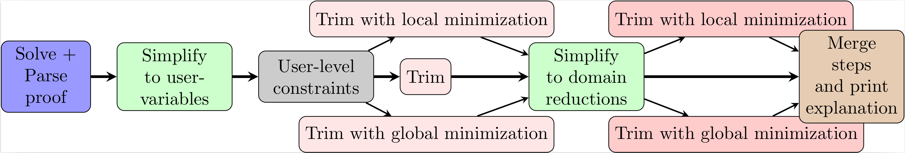

# Using Certifying Constraint Solvers for Generating Step-wise Explanations

This repository contains the code for the following paper:

> Bleukx, Ignace et al. Using Certifying Constraint Solvers for Generating Step-wise Explanations (AAAI 2026)

> **Abstract**
>   In the field of Explainable Constraint Solving, it is common to explain to a user why a problem is unsatisfiable. A recently proposed method for this is to compute a sequence of explanation steps. Such a step-wise explanation shows individual reasoning steps involving constraints from the original specification, that in the end explain a conflict. However, computing a step-wise explanation is computationally expensive, limiting the scope of problems for which it can be used. We investigate how we can use proofs generated by a constraint solver as a starting point for computing step-wise explanations, instead of computing them step-by-step. More specifically, we define a framework of abstract proofs, in which both proofs and step-wise explanations can be represented. We then propose several methods for converting a proof to a step-wise explanation sequence, with special attention to trimming and simplification techniques to keep the sequence and its individual steps small. Our results show our method significantly speeds up the generation of step-wise explanation sequences, while the resulting step-wise explanation has a quality similar to the current state-of-the-art.

> [link to paper pdf](https://arxiv.org/abs/2511.10428)

## Overview of the repository

```bash
.
├── benchmarks # files for benchmarks and model loading from disk
├── example.py # small example generating a sequence of a Sudoku
├── experiments.py # Runner to reproduce the experiments in the paper
├── __init__.py
├── proof2seq # main code of the method
│   ├── __init__.py 
│   ├── minimize.py # code for proof minimization
│   ├── mus.py # implementation of MUS-algorithms used
│   ├── parsing.py # code for solving the model with proof loggin enabled 
│   ├── pipeline.py # implementation of the full modular pipeline
│   ├── simplify.py # code for proof simplification
│   └── utils.py # utilities used throughout the code base
```


## Getting started

To run the code, you will need to install the CPMpy constraint solving library, and the Pumpkin solver.
Additionally, you will need a few utility packages.

```bash
$ pip install cpmpy pumpkins-solver numpy pandas tqdm natsorted
```

If you want to generate a step-wise explanation of your unsatisfiable CPMpy model, we recommend to look at `example.py`.
Here, you can simply drop in your CPMpy model instead of the Sudoku model and run the pipeline shown in the figure below.



Our method can be tweaked to your liking by enabling certain options in the pipeline.
For the best result, we recommend to use simple trimming in the first phase, and global minimization in the second (these are also the default parameters used in the pipeline).

## Citing
```bibtex
@inproceedings{bleukx2026certifying,
    author = {Ignace Bleukx and Maarten Flippo and Emir Demirović and Bart Bogaerts and Tias Guns},
    title = {Using Certifying Constraint Solvers for Generating Step-wise Explanations},
    booktitle = {Proceedings of The 40th Annual {AAAI} Conference on Artificial Intelligence },
    year = {2026},
    note = {accepted for publication}
}
```
